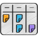

<!-- Improved compatibility of back to top link: See: https://github.com/othneildrew/Best-README-Template/pull/73 -->

<!--
*** Thanks for checking out the Best-README-Template. If you have a suggestion
*** that would make this better, please fork the repo and create a pull request
*** or simply open an issue with the tag "enhancement".
*** Don't forget to give the project a star!
*** Thanks again! Now go create something AMAZING! :D
-->

<!-- PROJECT SHIELDS -->
<!--
*** I'm using markdown "reference style" links for readability.
*** Reference links are enclosed in brackets [ ] instead of parentheses ( ).
*** See the bottom of this document for the declaration of the reference variables
*** for contributors-url, forks-url, etc. This is an optional, concise syntax you may use.
*** https://www.markdownguide.org/basic-syntax/#reference-style-links
-->

<!-- PROJECT LOGO -->
 

  

<h3 align="center">BoardWise</h3>

  

    Kanban-based project management tool
     
     
    <a href="https://github.com/github_username/repo_name">View Demo</a>
  

<!-- TABLE OF CONTENTS -->

  
Table of Contents

  <ol>
    <li>
      <a href="#about-the-project">About The Project</a>
      <ul>
        <li><a href="#built-with">Built With</a></li>
      </ul>
    </li>
    <li><a href="#contact">Contact</a></li>
  </ol>

<!-- ABOUT THE PROJECT -->

## About The Project
![Product Name Screen Shot][product-screenshot]

The project involves creating a comprehensive project management tool centered around Kanban boards. Kanban is a visual framework that aids in task management, allowing teams to visualize work, optimize workflows, and enhance collaboration. This tool will enable users to create, organize, and track tasks using Kanban boards, providing a clear overview of the project's progress. Key features may include task categorization, status updates, user assignments, and real-time collaboration. The goal is to streamline project workflows, boost team productivity, and enhance overall project management efficiency.

(<a href="#readme-top">back to top</a>)

### Built With

- [![Next][Next.js]][Next-url]
- [![React][React.js]][React-url]
- [![Prisma][Prisma]][Prisma-url]
- [![Tailwind][Tailwind]][Tailwind-url]
- [![PostgreSQL][PostgreSQL]][PostgreSQL-url]
- [![Clerk][Clerk]][Clerk-url]

(<a href="#readme-top">back to top</a>)

<!-- CONTACT -->

## Contact

Project Link: [https://github.com/ivanbutakov0/board_wise](https://github.com/ivanbutakov0/board_wise)

(<a href="#readme-top">back to top</a>)

<!-- MARKDOWN LINKS & IMAGES -->
<!-- https://www.markdownguide.org/basic-syntax/#reference-style-links -->

[product-screenshot]: public/screenshot.png
[Next.js]: https://img.shields.io/badge/next.js-000000?style=for-the-badge&logo=nextdotjs&logoColor=white
[Next-url]: https://nextjs.org/
[React.js]: https://img.shields.io/badge/React-20232A?style=for-the-badge&logo=react&logoColor=61DAFB
[React-url]: https://reactjs.org/
[Prisma]: https://img.shields.io/badge/Prisma-000000?style=for-the-badge&logo=prisma&logoColor=white
[Prisma-url]: https://prisma.io/
[Tailwind]: https://img.shields.io/badge/Tailwind-000?style=for-the-badge&logo=tailwindcss&link=https://tailwindcss.com/
[Tailwind-url]: https://tailwindcss.com/
[PostgreSQL]: https://img.shields.io/badge/PostgreSQL-000?style=for-the-badge&logo=postgresql&logoColor=white&link=https://www.postgresql.org/
[PostgreSQL-url]: https://www.postgresql.org/
[Clerk]: https://img.shields.io/badge/Clerk-000?style=for-the-badge&logo=clerk&link=https://clerk.com/
[Clerk-url]: https://clerk.com/
